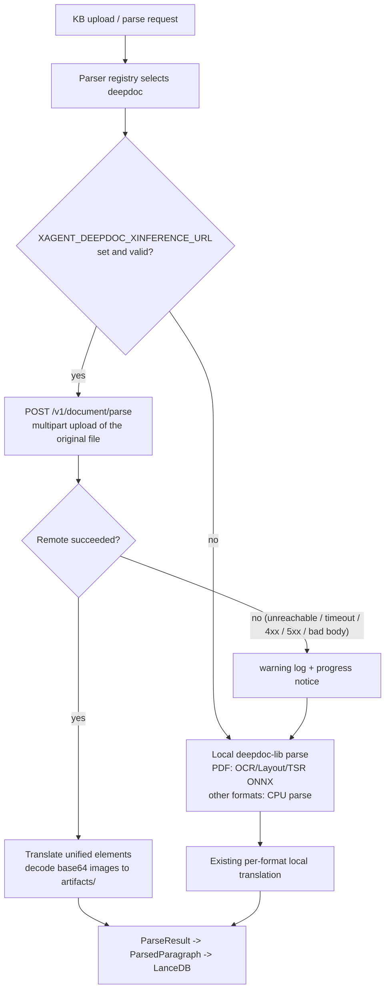
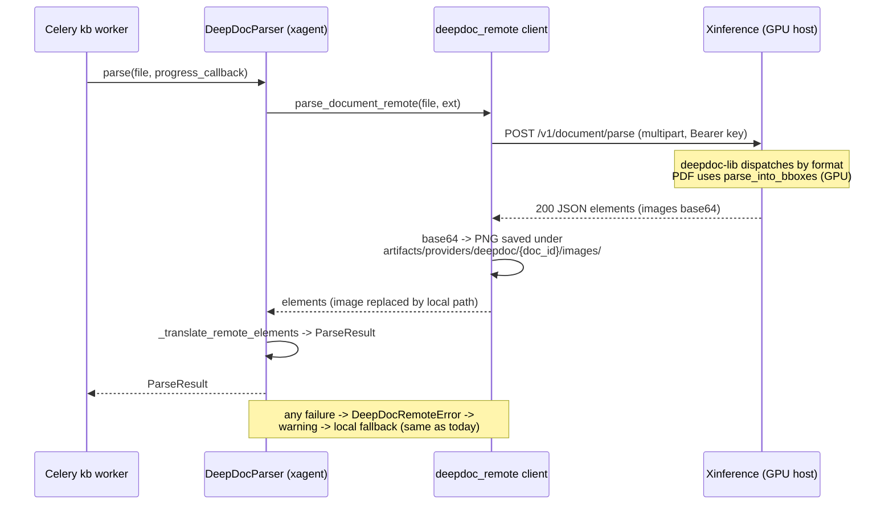

# DeepDoc Remote Parsing (Xinference GPU Offload)

## 1. Background

xagent's KB/RAG document parsing uses DeepDoc via the external `deepdoc-lib==0.2.2`
package. The PDF pipeline (OCR detection/recognition, layout analysis, table
structure recognition) runs entirely as local ONNX inference and is the dominant
cost on CPU-only deployments — large documents take minutes.

Two facts shape this design:

- `deepdoc-lib` 0.2.2 has **no usable remote inference path**. The
  `TENSORRT_DLA_SVR` hook in `vision/layout_recognizer.py` imports
  `deepdoc.vision.dla_cli`, a module that does not ship in the package.
- Xinference has no DeepDoc serving capability today. The server-side API in
  section 6 is a **proposal** to be implemented by the Xinference team (the same
  team maintains both projects).

## 2. Goals

- Users run DeepDoc document parsing on their own GPU machine through Xinference.
- xagent opts in purely through environment variables (URL + API key). Once
  configured, **every format `DeepDocParser` supports** (`.pdf`, `.docx`,
  `.xlsx`, `.xls`, `.csv`, `.md`, `.txt`, `.json`, `.html`) is routed to the
  remote service.
- On remote failure, parsing automatically falls back to local inference so
  ingestion never breaks.
- Zero user-facing change: no new `ParseMethod`, no frontend change. Existing
  knowledge bases already set to `deepdoc` get the speedup for free.

## 3. Non-goals

- Per-KB or per-request remote configuration (global env only).
- Asynchronous job submission with progress polling (v1 is a single synchronous
  call; noted as a v2 extension).
- Formats DeepDoc does not support anyway (`.doc`, `.pptx`).
- Any change to `deepdoc-lib` itself.

## 4. Flow

### 4.1 Routing and fallback



### 4.2 Sequence (remote success path)



## 5. Configuration (xagent side)

| Environment variable | Required | Default | Notes |
|---|---|---|---|
| `XAGENT_DEEPDOC_XINFERENCE_URL` | yes, to enable remote | unset (= local mode) | Xinference base URL, e.g. `http://gpu-host:9997`. Validated as `http`/`https`, trailing slash stripped. |
| `XAGENT_DEEPDOC_XINFERENCE_API_KEY` | no | falls back to bare `XINFERENCE_API_KEY`, then no auth header | Self-hosted Xinference without auth can leave this unset. |
| `XAGENT_DEEPDOC_XINFERENCE_TIMEOUT_SECONDS` | no | `1800` | Read timeout for one whole-document parse, matching the `timeout=1800` precedent in deepdoc-lib's own MinerU API client. |

There is deliberately **no fallback toggle**: fallback is always on, which is what
makes the switch transparent. A malformed URL degrades to local mode with a
warning rather than failing every parse.

## 6. Proposed server API contract (v1)

```
POST {base_url}/v1/document/parse
Authorization: Bearer <api_key>          # omitted when the client has no key

Request (multipart/form-data):
  file         binary  required            original file; filename preserved
                                           (server dispatches on the extension)
  zoomin       int     default 3           PDF only, forwarded to parse_into_bboxes
  image_scope  str     default table_figure    table_figure | all | none

Response 200 application/json:
{
  "filename": "report.pdf",
  "file_type": ".pdf",
  "elapsed_ms": 45210,
  "elements": [
    {
      "type": "text",              // "text" | "table" | "figure"
      "text": "…",                 // HTML for tables, matching local behavior
      "image_base64": null,        // PNG base64 for table/figure, null otherwise
      "metadata": { ... }          // format specific, see the table below
    }
  ]
}

Errors: 400 invalid/unsupported file, 401 auth failure, 413 file too large,
        500 inference failure. Body is always {"detail": "..."}.
```

Per-format server behavior and required metadata. The goal is semantic parity
with xagent's existing local parsing so remote and local results are
interchangeable when fallback kicks in.

| Format | Server-side parsing | Required `element.metadata` keys |
|---|---|---|
| `.pdf` | `RAGFlowPdfParser().parse_into_bboxes(zoomin)`. Coerce numpy scalars to Python numbers, drop the internal `position_tag`, and encode images only for table/figure elements — upstream attaches a crop to every bbox, but the client only consumes table/figure images, so stripping text images cuts the payload substantially. | `page_number`, `x0`, `x1`, `top`, `bottom`, `layout_type`, `col_id`, `positions` (`[[page, left, right, top, bottom], …]`) |
| `.docx` | `DoclingParser` (fall back to python-docx when unavailable), including images and captions | text sections: `style`; images emitted as `figure` elements |
| `.xlsx` | One text element per row, mirroring xagent's `_parse_xlsx_rows` semantics: title/header/data row classification, `header: value \| …` joining, sheet-name prefix when multiple sheets | `sheet_name`, `row_number`, `row_type` (`title` \| `header` \| `data`) |
| `.xls`, `.csv` | deepdoc `ExcelParser` | `sheet_name` (best effort) |
| `.md` | `extract_tables_and_remainder`; tables become their own elements | tables emitted with `type: "table"` |
| `.txt`, `.json`, `.html` | corresponding parser / direct read | none required |

Progress: v1 is a single synchronous request and the client uses a long read
timeout. An asynchronous variant (`202` plus
`/v1/document/parse/jobs/{id}`) is a possible v2 extension and does not break
this contract, since xagent only surfaces coarse status strings today.

## 7. Acceptance criteria

1. **Env unset** — behavior is byte-for-byte the current behavior (fully local).
2. **Env set, service healthy** — every DeepDoc-supported format is parsed
   remotely; local ONNX models are **not loaded** and no ModelScope download is
   triggered; results (text segments, tables, figures, their metadata,
   `positions`, saved images) are semantically equivalent to local output so
   downstream chunking/embedding/retrieval is unaffected; result metadata
   carries `deepdoc_backend=remote`.
3. **Env set, service unreachable / timing out / 5xx / bad body** — a warning is
   logged, a progress notice is emitted, parsing falls back to local and
   succeeds, and metadata carries `deepdoc_backend=local`.
4. **Malformed URL** — degrades to local mode with a warning; no parse fails.
5. **Progress** — remote mode reports "Uploading…" and "Remote parse finished";
   on fallback the failure notice is followed by the normal local progress
   stream.
