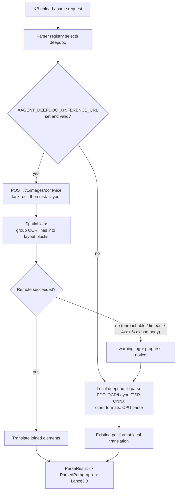
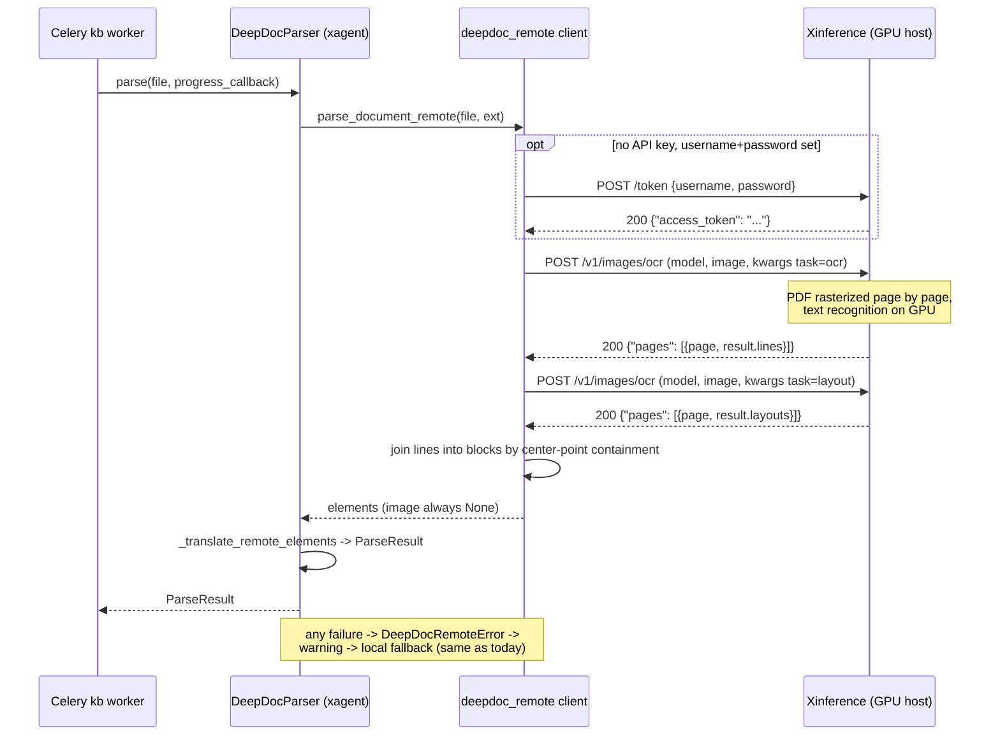

# DeepDoc Remote Parsing (Xinference GPU Offload)

## 1. Background

xagent's KB/RAG document parsing uses DeepDoc via the external `deepdoc-lib==0.2.2`
package. The PDF pipeline (OCR detection/recognition, layout analysis, table
structure recognition) runs entirely as local ONNX inference and is the dominant
cost on CPU-only deployments — large documents take minutes.

Two facts shape this design:

- `deepdoc-lib` 0.2.2 has **no usable remote inference path**. The
  `TENSORRT_DLA_SVR` hook in `vision/layout_recognizer.py` imports
  `deepdoc.vision.dla_cli`, a module that does not ship in the package.
- Xinference ships DeepDoc as an **image/OCR model**, not as a whole-document
  parse API (xorbitsai/inference#5230). An earlier revision of this document
  proposed a `POST /v1/document/parse` endpoint returning fully structured
  elements. **That endpoint does not exist.** Section 6 now documents the real
  `POST /v1/images/ocr` contract, measured against a running server, and
  section 8 records what is lost by building on it.

## 2. Goals

- Users run DeepDoc document parsing on their own GPU machine through Xinference.
- xagent opts in purely through environment variables (URL + API key). Once
  configured, **every format `DeepDocParser` supports** (`.pdf`, `.docx`,
  `.xlsx`, `.xls`, `.csv`, `.md`, `.txt`, `.json`, `.html`) is routed to the
  remote service.
- On remote failure, parsing automatically falls back to local inference so
  ingestion never breaks.
- Zero user-facing change: no new `ParseMethod`, no frontend change. Existing
  knowledge bases already set to `deepdoc` get the speedup for free.

## 3. Non-goals

- Per-KB or per-request remote configuration (global env only).
- Asynchronous job submission with progress polling (v1 is a single synchronous
  call; noted as a v2 extension).
- Formats DeepDoc does not support anyway (`.doc`, `.pptx`).
- Any change to `deepdoc-lib` itself.

## 4. Flow

### 4.1 Routing and fallback



### 4.2 Sequence (remote success path)



## 5. Configuration (xagent side)

| Environment variable | Required | Default | Notes |
|---|---|---|---|
| `XAGENT_DEEPDOC_XINFERENCE_URL` | yes, to enable remote | unset (= local mode) | Xinference base URL, e.g. `http://gpu-host:9997`. Validated as `http`/`https`, trailing slash stripped. |
| `XAGENT_DEEPDOC_XINFERENCE_MODEL_UID` | no | `DeepDoc` | The `model` form field: the UID the DeepDoc model was launched under. |
| `XAGENT_DEEPDOC_XINFERENCE_API_KEY` | no | falls back to bare `XINFERENCE_API_KEY`, then to the username/password exchange, then no auth header | Sent as the bearer token verbatim. Xinference accepts both a static API key and a JWT here, and the client does not try to tell them apart. |
| `XAGENT_DEEPDOC_XINFERENCE_USERNAME` | no | unset | Used only when no API key is set. Both this and the password must be present for the `/token` exchange to be attempted. |
| `XAGENT_DEEPDOC_XINFERENCE_PASSWORD` | no | unset | Paired with the username. Not whitespace-stripped, since whitespace can be part of a password. |
| `XAGENT_DEEPDOC_XINFERENCE_TIMEOUT_SECONDS` | no | `1800` | Read timeout for one whole-document parse, matching the `timeout=1800` precedent in deepdoc-lib's own MinerU API client. The `/token` exchange uses a fixed 30s instead, so a hung auth endpoint fails fast into the fallback. |

There is deliberately **no fallback toggle**: fallback is always on, which is what
makes the switch transparent. A malformed URL degrades to local mode with a
warning rather than failing every parse.

## 6. Server API contract (measured)

This is the real, shipped endpoint, verified against a running Xinference with a
GPU-backed DeepDoc.

```
POST {base_url}/v1/images/ocr
Authorization: Bearer <jwt or api key>     # omitted when unauthenticated

Request (multipart/form-data):
  model   str     required   the launched model UID, e.g. "DeepDoc"
  image   binary  required   the document; a PDF part must carry
                             Content-Type: application/pdf
  kwargs  str     optional   a JSON *string*, not a nested structure.
                             Supports task, pages, dpi, return_dict, threshold.

Response 200 application/json:
{"pages": [{"page": 1, "result": {"task": "...", ...}}]}
```

PDFs are handled entirely server-side: the server rasterizes page by page and
merges the per-page results. `dpi` controls the raster resolution; there is no
`zoomin` scale factor, so the client's `zoomin` argument is not forwarded.

### 6.1 Task payloads

`task=ocr` with `{"return_dict": true}` — recognized text lines:

```json
{"pages": [{"page": 1, "result": {"task": "ocr", "lines": [
  {"box": [[197,213],[712,220],[711,275],[196,268]],
   "text": "Sample Document", "score": 0.9995}]}}]}
```

`box` is a **four-point quadrilateral**, not `x0/x1/top/bottom`, because
recognized text can be skewed. The client reduces it to its bounding rectangle.

`task=layout` — block structure, with no text:

```json
{"pages": [{"page": 1, "result": {"task": "layout", "layouts": [
  {"type": "title", "bbox": [197.18, 214.05, 713.41, 275.98], "score": 0.9397}]}}]}
```

`bbox` is `[x0, y0, x1, y1]`. `type` is DeepDoc's label set, lower-cased:
`_background_`, `text`, `title`, `figure`, `figure caption`, `table`,
`table caption`, `header`, `footer`, `reference`, `equation`.

`task=table` — raw cell/row/column boxes, in `x0/x1/top/bottom` form, with
**no table HTML**. The client does not use this task: without HTML it adds
nothing the layout task does not already give.

### 6.2 Authentication

Authentication is a JWT, not a static key:

```
POST {base_url}/token
{"username": "...", "password": "..."}   ->   {"access_token": "..."}
```

On a fresh deployment the first admin is created once via
`POST /v1/admin/setup`. A deployment that issues a static API key instead can
configure that key directly; the client sends whatever it is given as the bearer
token verbatim and does not try to distinguish the two.

### 6.3 The spatial join

Neither task returns text grouped into blocks: `ocr` gives lines without
structure, `layout` gives structure without text. The client therefore issues
both over one connection and joins them.

The join is sound because the two tasks were **measured to share one coordinate
space** — on the sample document, `ocr` spanned x∈[193,1499] y∈[213,1804] and
`layout` spanned x∈[196,1503] y∈[214,1803], with the first line of each covering
the same region.

The algorithm, per page:

1. Rank layout blocks. `table` and `figure` rank highest, plain blocks next,
   `figure caption` and `table caption` lowest. Captions rank last from measured
   behavior, not taste: the layout model emitted `table caption` over blocks it
   had also labelled `title` and `text`, and those labels were the better ones.
2. In rank order, each block claims the still-unclaimed OCR lines whose **center
   point** falls inside its bbox. Center-point containment means a line poking
   slightly out of its block still belongs to it, and each line is claimed at
   most once, so overlapping blocks cannot duplicate text.
3. Claimed lines are joined with `"\n"` in reading order (sorted by `y`, then
   `x`). The element's bounds are the union of its lines, describing the text
   rather than the detector's guess.
4. `type` is mapped from the layout label: `table` → `table`,
   `figure`/`figure caption` → `figure`, everything else → `text`.
5. Any line **no block claimed becomes its own text element**. Dropping
   recognized text would be strictly worse than emitting it unstructured, so the
   join never loses content.
6. Elements are sorted by `(page, top, x0)`.

Each element carries `page_number`, `x0`, `x1`, `top`, `bottom`, `layout_type`
(the raw label), `col_id: 0`, and `positions: [[page, x0, x1, top, bottom]]`,
which is what `_build_element_metadata` in `deepdoc.py` consumes. `image` is
always `null`.

## 7. Capability differences vs local parsing

Remote mode is a **real downgrade in output fidelity**, traded for speed. Enable
it knowingly. Building on an OCR endpoint rather than a document-parse endpoint
means the following are simply not available:

| Capability | Local | Remote | Consequence |
|---|---|---|---|
| Table HTML | Table structure recognition reconstructs `<table>` markup with merged-cell headers | Not available — the `table` task returns only cell boxes | A table's text is its OCR lines joined by newline. Row/column structure is lost, so retrieval over tabular data degrades. |
| Figure and table images | Crops saved under `artifacts/providers/deepdoc/{doc_id}/images/` | Not available — no image bytes are returned | `image_path` is `None` on every element. Anything downstream that displays or re-analyzes a crop has nothing to work with. |
| Cross-line paragraph merging | An XGBoost model merges lines into semantic paragraphs, including across column and page breaks | Not available — blocks are whatever the layout model drew | Paragraph boundaries follow layout detection alone, so a paragraph split across two detected blocks stays split. |
| Cross-page coordinate accumulation | Positions accumulate into a continuous document-level space | Not available — coordinates are per-page, in rasterized pixel space | `positions` are page-local and in a different unit than local output. PDF highlight overlays built for local coordinates will not line up. |
| `col_id` (two-column layout) | Derived from column detection | Always `0` | Multi-column reading order is approximated by the `(page, y, x)` sort. |

Non-PDF formats (`.docx`, `.xlsx`, `.csv`, `.md`, …) are **not** served by an
image OCR endpoint at all. Measured: uploading `test.docx` returns
`500 {"detail": "cannot identify image file ..."}`. They are still routed
remotely when the URL is set, so each one costs a wasted round trip before the
standard fallback parses it locally. The outcome is correct but the trip is
pointless; restricting remote mode to PDFs and images is the obvious next step.

## 8. Acceptance criteria

1. **Env unset** — behavior is byte-for-byte the current behavior (fully local).
2. **Env set, service healthy** — parsing is routed remotely; local ONNX models
   are **not loaded** and no ModelScope download is triggered; **no recognized
   text is lost or duplicated** by the join; elements carry the metadata shape
   `_build_element_metadata` expects; result metadata carries
   `deepdoc_backend=remote`. Note that output is *not* semantically equivalent
   to local output — see section 7.
3. **Env set, service unreachable / timing out / 5xx / bad body** — a warning is
   logged, a progress notice is emitted, parsing falls back to local and
   succeeds, and metadata carries `deepdoc_backend=local`.
4. **Malformed URL** — degrades to local mode with a warning; no parse fails.
5. **Progress** — remote mode reports "Uploading…" and "Remote parse finished";
   on fallback the failure notice is followed by the normal local progress
   stream.

## 9. Measured results

Against a live Xinference (DeepDoc on GPU) parsing the 3-page
`tests/resources/test_files/test.pdf`:

| | Remote | Local fallback (URL pointed at a dead port) |
|---|---|---|
| `deepdoc_backend` | `remote` | `local` |
| Local parser instantiated | no | yes |
| Wall time | 2.6s (two calls plus the token exchange) | ~40s |
| Text segments / tables / figures | 22 / 2 / 2 | 48 / 2 / 2 |
| Extracted characters | 2606 | 3331 |
| Table output | OCR lines joined by newline | reconstructed `<table>` HTML |

Join fidelity: the server returned **103 non-blank OCR lines** and the join
emitted **103** — zero lost, zero duplicated. Blocks were labelled sensibly
(`title` for headings, `table` for both tables, `figure` for both images), and
the two-column section on page 3 correctly produced two separate elements.

The character difference is not text loss: remote joins lines into blocks (one
element per paragraph), local emits one element per line, and local
additionally emits table HTML markup, which inflates its count.
